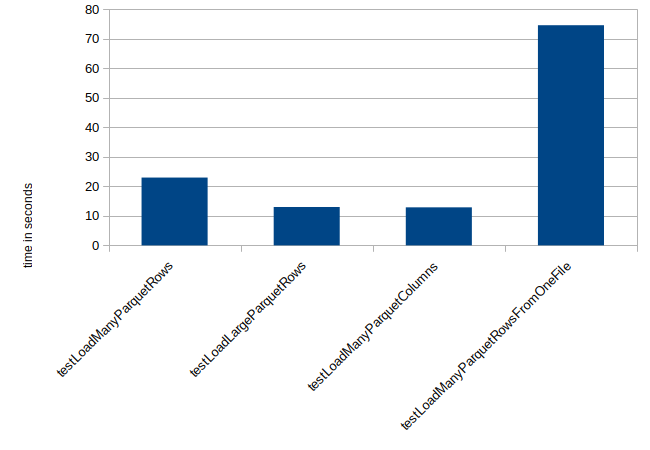

# How we Improved the Files Virtual Schema Performance

Our [Virtual Schemas for document files](https://github.com/exasol/virtual-schema-common-document-files) allow our customers to integrate formatted data from files into their Exasol database. Our customers use this feature for integrating external data on demand into their analytics calculation and for building Extract, Transform and Load (ETL) pipelines.

For Exasol speed matters. So does it for our integrations. For customers, it's crucial that the queries accessing external data run as fast as possible. In this blog post I want to give you some insights from our recent performance improvements of the Virtual Schema for [Apache Parquet](https://parquet.apache.org/) files.

## How it Begins

For me, this project started when our product manager asked me to improve the performance of the Parquet file loading. He compared the performance of our products with other solutions. As a result of this comparison, we realized that our Parquet loading needs major improvements.

To do professional performance improvements we use the simple workflow:

Measure &#8594; Improve &#8594; Measure.

In my eyes, this simple strategy brings lots of advantages:

First, it allows you to check whether a change helped or if it even made some functionality slower. For example, improving the performance of loading big Parquet files can easily slow down the loading of many small files. Second, this strategy allows you to define a goal when to stop. Otherwise, you will keep improving forever since there's always a space for improvements.

## Writing Performance Tests

So my first step was to write automated performance tests for the Parquet loading. Don't get me wrong. It's not that we did not have any tests before. Of course, we had unit and integration tests for the Virtual Schema that make sure that it works as expected. But since this is a rather new product we did not have automated performance tests yet.

Until now, we checked the performance of Virtual Schema manually by starting a cluster and querying a Parquet formatted dataset. However, for these performance improvements, we needed more test cases and also more reliability.

While for our integration tests we use the docker version of Exasol (which is sufficient for functional testing), for the performance test we want to test with a real-live setup. So we decided to test with a 4 node cluster (with `c5.4xlarge` instance types) on AWS. There, we load the files from S3 using the [s3-document-files-virtual-schema](https://github.com/exasol/s3-document-files-virtual-schema).

The Virtual Schemas are built out of multiple layers:

The Parquet loading implementation is located in the Document Files Virtual Schema. However, we can't test this directly. Instead, we decided to test the S3 implementation, since this is the most popular dialect.

### Test Quality

We measure the query performance by observing the execution time of a query on a Virtual Schema table. By that, we measure the full execution time including network transmission, S3 loading, and so on. This of course adds some noise to our measurement. However, we decided on this strategy since it evaluates the time that our customers can expect.

In order to make the tests more reliable, we run each test 5 times. Then we drop the first 2 results since they are usually slower. Then we build the average of the remaining 3 runs. We decided on the average since it will again result in a value that customers can expect.

### Test Fixtures

For our performance test, we need some test fixtures. For example one big Parquet file on S3 that we load with a Virtual Schema and measure the performance.

The simplest option for this is to create this file with a local tool and store it forever on S3. This approach has the advantage, that it's easy to create. On the other hand, it's hard to change, and it's also not apparent from the source code how the test data is created. Since our projects are open source, it is also important that all external contributors can run the tests. This however would require us to make our S3 bucket publicly available which could cause additional costs.

These issues can be solved by creating the test data on-the-fly before running the test. Then the test-data is documented and under version control. That can be very helpful, to make sure that there were no changes on the test fixture between two runs.

One downside of this approach is that it only works for rather small test files. For larger files, creating and uploading the files gets too expensive and becomes too slow. To solve this we added a cache. Before uploading the test files, we create a checksum and check if the files are already in place. Only if there were changes we re-upload the files.

## Displaying Performance Tests Results

In order to evaluate the test results, and discuss them, we need to visualize them. For that we decided on a [Redash](https://redash.io/) dashboard. Redash is an open source tool that allows you to create online dashboards for SQL queries. So we push our performance test results into an Exasol database and use Redash to evaluate them.

## Setting Goals

The first test run generated the following results:

| Test Case                          | Time in Seconds |
|------------------------------------|-----------|
| testLoadManyParquetRows            | 23        |
| testLoadLargeParquetRows           | 13.02     |
| testLoadManyParquetColumns         | 12.9      |
| testLoadManyParquetRowsFromOneFile | 74.64     |
| testManySmallJsonFiles             | 685.87    |
| testLoadFewBigSalesParquetFiles    | 662.28    |
| testLoadSalesParquetFiles          | 219.21    |

The first 4 cases (`testLoadManyParquetRows`, `testLoadLargeParquetRows`, `testLoadManyParquetColumns` `testLoadManyParquetRowsFromOneFile`) all load the same amount of data (1 GB). They just differ on how the data is distributed over rows, files and columns.

This dataset consists of pseudo-random generated strings. The different test cases are built as show in the following table:

| Test Case                          | String size in byte | Rows      | Files | Columns |
|------------------------------------|---------------------|-----------|-------|---------|
| testLoadManyParquetRows            | 100                 | 1000000   | 10    | 1       |
| testLoadLargeParquetRows           | 1,000,000           | 100       | 10    | 1       |
| testLoadManyParquetColumns         | 1000                | 1000      | 10    | 100     |
| testLoadManyParquetRowsFromOneFile | 1,000               | 1,000,000 | 1     | 1       |

You can observe that the product of all columns is always 1,000,000,000 so 1 GB.

The last two tests use exemplary sales data consisting of 7 decimal columns with 3,621,459,710 rows. These two tests split the the sales data into 8 (`testLoadFewBigSalesParquetFiles`) and 200 (`testLoadSalesParquetFiles`) files respectively.

From the charts, it becomes clear that the Virtual Schema at that point has an issue with loading data from a few big files. When loading from more files, it loads the same amount of data a lot quicker.

Starting with this analysis, we discussed with our product management and decided to invest in performance improvements for loading big Parquet files. More precisely we set the goal to make improvements so that the `testLoadFewBigSalesParquetFiles` also runs in less than 250s.

## Improving the Performance

Next, we analyzed the source code for possible reasons for the slow reading of big Parquet files. We identified the following issues:

* Unequal distribution
* Less parallelization for a few Parquet files

The query processing of the Files Virtual Schemas consists of two phases: A planning phase and an execution phase. In the planning phase, the adapter analyzes the query and starts multiple workers, using [User Defined Functions (UDFs)](https://docs.exasol.com/database_concepts/udf_scripts.htm), that then run the execution phase. Thus, Virtual Schema parallelizes the execution of external data import over multiple workers. For technical reasons, the workers can not communicate at the moment.

### Distributing the File

Until now this parallelization was realized using hash binning. With this approach, each worker receives a range and then loads files where the hash value of the file-name fells into that range. That approach is great for distributing lots of files since it does not require listing files in advance. Doing so could cause memory overflow when distributing for example 1,000,000 files with long names.

However, for only a few files, this is not very optimal. Imagine distributing 4 files over 4 workers. A good distribution is obvious here. Each worker receives one file. With hash binning it's however quite likely, that one worker receives two files and another receives none. This will increase the time for loading.

To fix this issue we changed the implementation to distribute smaller number of files explicitly and only use hash binning for many files.

### Splitting Large Files

The second problem occurs, if there are 4 workers but only one file. In that case only one worker will be used. To mitigate this issue, we decided to split the file into multiple parts. That's not possible for all file formats. For example with JSON files where each file contains one document or one row. For Parquet, however it is possible. Parquet files contain multiple rows, and group these rows into blocks called `row groups`. We changed our Parquet reader so that it's capable of only reading specific row groups. By that, we can again distribute the work over all available workers.

## Results

The chart shows the duration of the test runs. Run number 1 on the x-axis is the one we discussed earlier. Run number 2 is measured after we improved the distribution of the files. Run number 3 is after implementing the file splitting.

The results prove that our improvements had the desired effect. Distributing the files explicitly helped a bit for `testLoadFewBigSalesParquetFiles`. We expected this since before we had the risk that the 8 files were not distributed equally over the workers.

The second improvement with splitting the files helped considerably for `testLoadFewBigSalesParquetFiles` and `testLoadManyParquetRowsFromOneFile`.