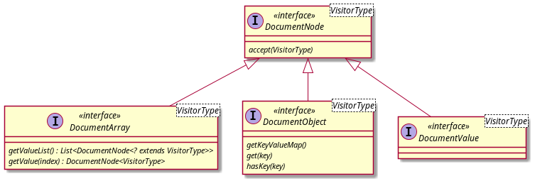

# How to add Support for a new Document Type

This guide explains how to add support for new document types like JSON or JSON-Lines.

If you want to add support for different file backends like BucketFS or S3, use the [dialect development guide](dialect_development_guide.md).

## Create a Repository

The generic adapter loads the document type implementations using a service loader. By that, you can implement your document type in a different repository and simply add its jar in the `CREATE ADAPTER SCRIPT` command.

## The Document Node Interface

The document Virtual Schema abstracts over the implementation of the document data. By that, it can support different document types. For that we use the `DocumentNode` interface structure:



The idea behind this structure is, that this Virtual Schema adapter can traverse your document data, without knowing implementation details, like the language-specific data types.

Implement this structure in the following steps:

* Select a name for your document structure (in this example we will use `YOUR_TYPE`)
* Implement a factory that wraps the Java classes of your data type into wrapper classes that implement the `DocumentNode` interface. For that task you can use the given wrapper classes like `StringHolderNode` or implement custom classes that implement the `DocumentNode` interface.

If your data type does not have a Java API you can also create your own parser, that implements these interfaces.

## The DocumentFetcher

Now we implement the `DocumentFetcher` interface. The `DocumentFetcher` has the task to fetch the document data for a given query from the data source. For Virtual Schemas that load files, we can use the abstract base implementation `AbstractFilesDocumentFetcher`.

So start with creating a new class called `YOUR_TYPEDocumentFetcher` that extends `AbstractFilesDocumentFetcher<YOUR_TYPEDocumentNodeVisitor>`.

The interface requires only a single method:

```java
protected abstract Stream<DocumentNode<DocumentVisitorType>>readDocuments(InputStreamWithResourceName remoteFile);
```

Inside this method, you need to load the data and convert it into your class structure implementing the `DocumentNode` interfaces. The parameter `InputStreamWithResourceName` consists of an `InputStream` from which you can parse the data and a file name, that you can use for logging.

Implement the method so that it converts the `loadedFile` into a `Stream<DocumentNode<YOUR_TYPEDocumentNodeVisitor>>` by parsing it and using the factory for your class structure. If your datatype has only one document per file, simply return `Set.of(YOUR_DOCUMTNT_NODE)`. Otherwise it is important to stream the data and not to collect it in a List first. For that implement a custom `Iterator` and `Iterable` and use:

```java
return StreamSupport.stream(new YOUR_ITERABLE (remoteFile).spliterator(),false);
```

Don't forget to close the input streams!
The best practice for that task is to add a handler using `.onClose` to the stream.

## The FilesDocumentFetcherFactory

Finally, we add a factory for the newly defined `DataLoader`. For that create a new class named `YOUR_TYPEFilesDataLoaderFactory`:

```java


public class YOUR_TYPEFilesDataLoaderFactory extends AbstractFilesDocumentFetcherFactory {

    @Override
    public List<String> getSupportedFileExtensions() {
        return List.of(".YOUR_TYPE");
    }

    @Override
    protected DocumentFetcher buildSingleDocumentFetcher(final FileLoaderFactory fileLoaderFactory,
                                                         final SegmentDescription segmentDescription, final StringFilter sourceFilter) {
        return new YOUR_TYPEDocumentFetcher(sourceString, segmentDescription, fileLoaderFactory);
    }
}
```

Now we introduce the new `DataLoaderFactory` to the generic adapter. To do so create a file `META_INF/services/com.exasol.adapter.document.files.FilesDocumentFetcherFactory` with the fully qualified name of your `DocumentFetcherFactory`. For Example:

```
com.exasol.adapter.document.files.YOUT_TYPEDocumentFetcherFactory
``` 

## Tests

Don't forget to test your dialect. Take a look at JSON document type inside the repository as an example.

## Support

If you need help, feel free to create a GitHub issue in this repository.

## Tell the World

When you are finished with your document type implementation, we are happy to list it on the README of this repository, so that others can find it. Just open an issue!
